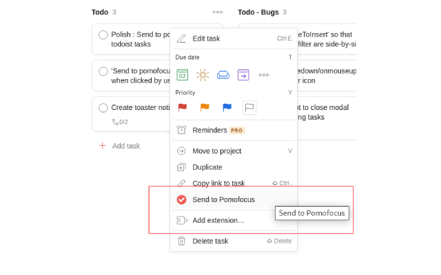
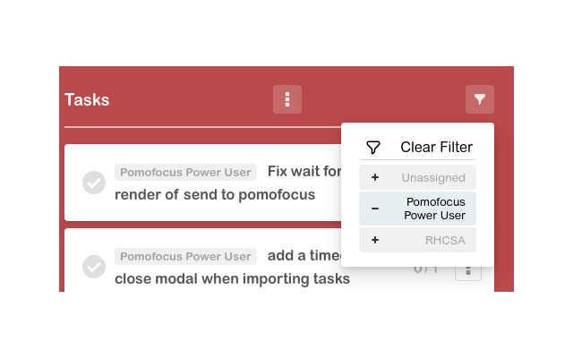

# Pomofocus Quality of Life
If you're enough of a pomofocus.io power user to pay for the premium pomofocus offering, this extension may help your workflow. 

- Enhanced todoist integration: send tasks over directly from todoist.
- Project filters: make a long pomofocus backlog more manageable.

These simple features can go a long way to make any large projects you work on more digestible.

## Installation
1. Now on the [chrome web store](https://chrome.google.com/webstore/detail/pomofocus-quality-of-life/cgjcmonifjkgeepfjfbbhegbohehpfdp?hl=en-GB&authuser=0)!

Or:

1. Navigate to the [releases](releases/tag/release) tab.
2. Follow those instructions.

## Development
1. Clone this repository.
2. Navigate to `chrome://extensions/` in your browser.
3. Enable developer mode.
4. Click "Load unpacked" and select the cloned repository.
5. Run `npm install`
6. Run `npm run watch` to build the extension as you develop.
7. After you make changes, click the refresh button on the extension in `chrome://extensions/` to reload the extension.

# Patch Notes
## 1.0.2
- Bugfix for sending tasks with a description
- Added a toast to clear cache if item is not found

## 1.0.1
- Fix 'import' button not being selected on pomofocus.io
- Added a toast to tell you when you're not logged in

## 1.0.0
- Initial release / MVP
